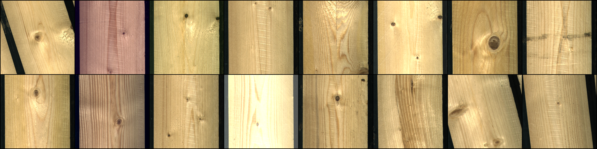
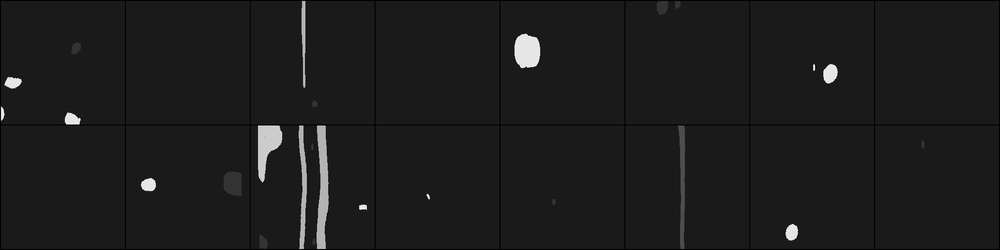
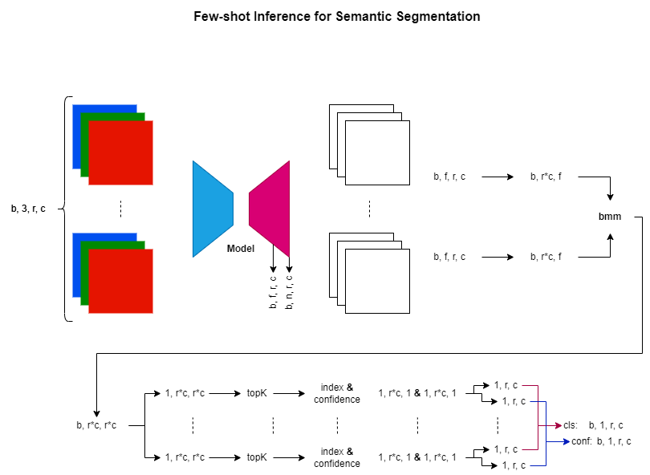

# Semantic Segmentation
Configure *config.yml*

Run *python train.py* to start training

The model checkpoints will be saved to *checkpoints/* folder

### Inference Examples from the Latest Training

#### Image

#### Target Mask

#### Predicted Mask

### Planned
#### Few-shot Inference
